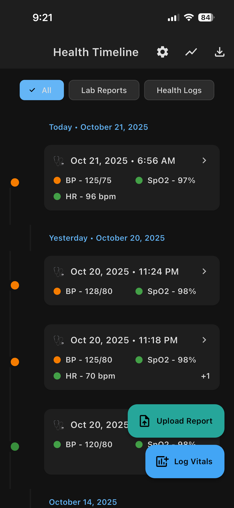
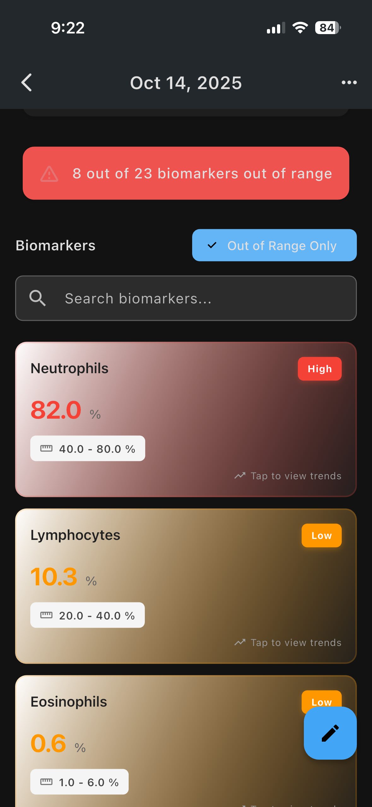
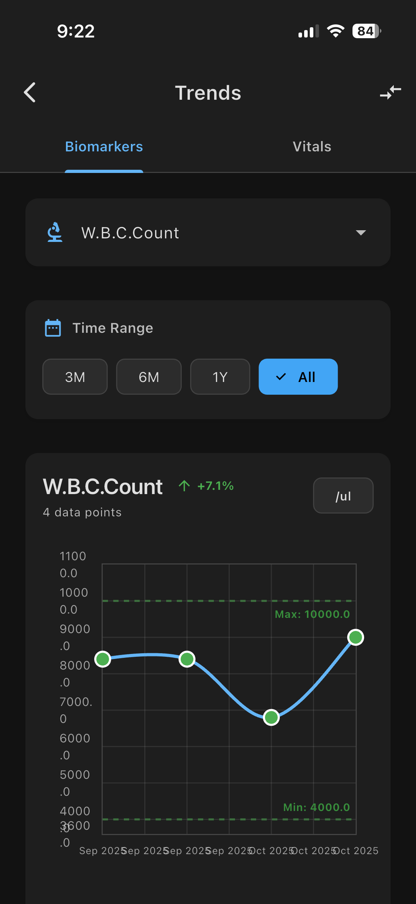
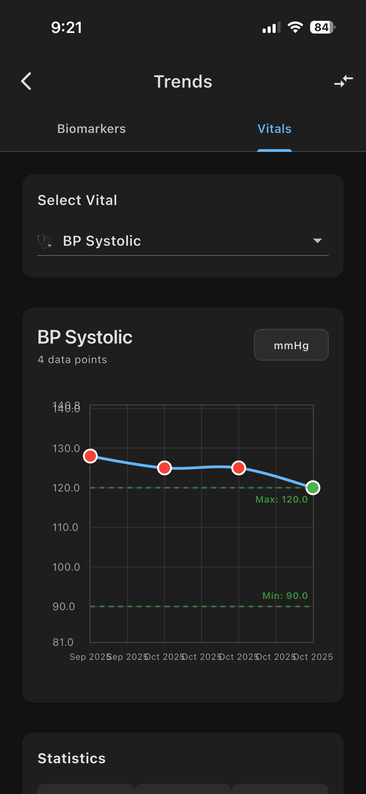
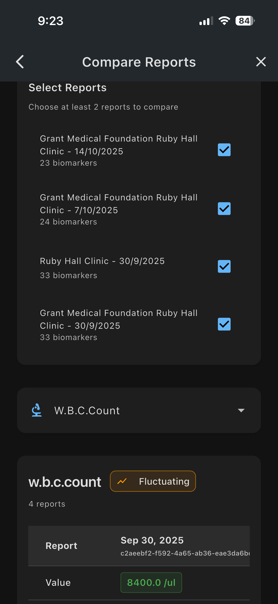
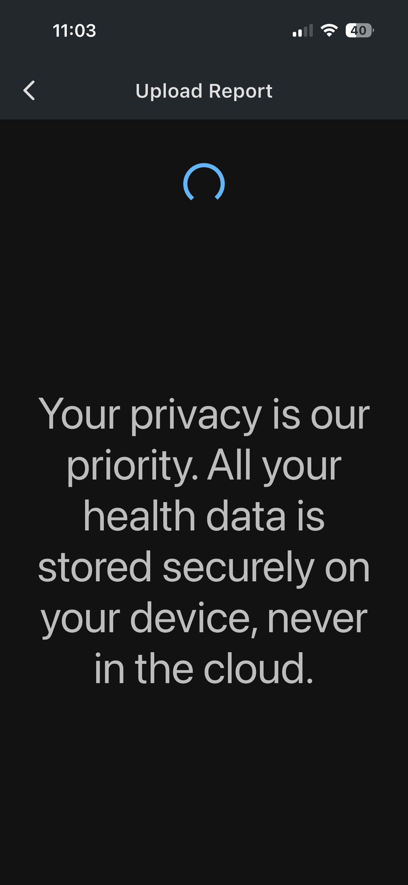
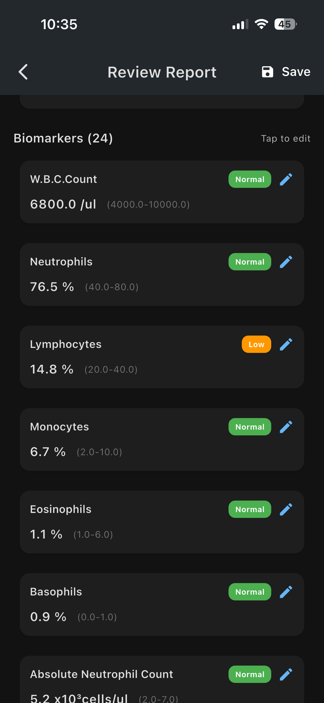
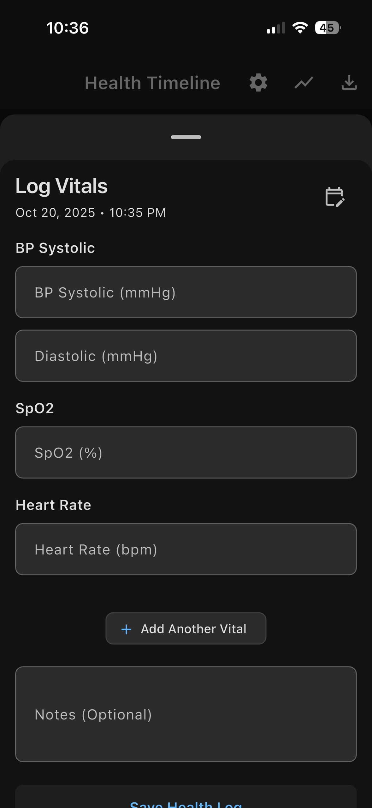
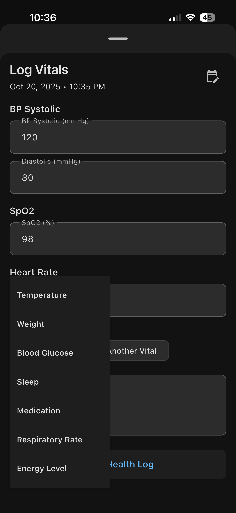

# Health Tracker

[](LICENSE)
[](https://flutter.dev)
[]()

## Table of Contents

*   [Overview](#overview)
*   [Motivation](#motivation)
*   [App Preview](#app-preview)
*   [For End User](#for-end-user)
    *   [Features](#features)
    *   [Usage Guidelines](#usage-guidelines)
    *   [Configuration](#configuration)
*   [Technical Details](#technical-details)
    *   [Getting Started & Building the Project](#getting-started--building-the-project)
    *   [Technical Overview](#technical-overview)
    *   [AI-Assisted Development](#ai-assisted-development)
    *   [Tooling & Development Environment](#tooling--development-environment)
*   [Known Issues & Limitations](#known-issues--limitations)
*   [Future Enhancements](#future-enhancements)
*   [Show Your Support](#show-your-support)
*   [Disclaimer](#disclaimer)
*   [Contributing](#contributing)
*   [License](#license)

## Overview

A privacy-focused Flutter application for tracking your personal health data. All data is stored locally on your device.

Upload your medical reports in PDF format for AI-powered biomarker extraction, log daily vitals (e.g., heart rate, blood pressure), and monitor trends over time. Export your raw data or generate shareable summaries for your healthcare providers.

**Supported Platforms:** iOS • Android

## Motivation

This project was born from two key needs:

1. **AI-Assisted Development:** To validate and establish a robust framework for an AI agent capable of performing production-ready software development, from planning through implementation and testing.

2. **Personal Health Management:** To address the lack of privacy-focused health tracking solutions that don't compromise on features or user experience.

Most health tracking apps either rely on cloud storage (raising privacy concerns) or lack comprehensive features. Health Tracker fills this gap with a **privacy-first approach** where all sensitive health data remains securely on your device, while still providing AI-powered insights and professional reporting capabilities.

## App Preview

Here's a quick look at the Health Tracker in action:

### Screenshots

<div style="display: flex; flex-wrap: wrap; justify-content: space-around; gap: 10px;">
    
    
    
    
    
    
    
    
    
</div>

### Video Demo

[](https://www.youtube.com/watch?v=GFM1JJVlt7I)

## For End User

### Features

*   **Upload Medical Reports:** Easily upload your medical reports in PDF format for intelligent extraction of biomarkers.
*   **Comprehensive Vital Tracking:** Log a wide range of daily vitals including Blood Pressure (Systolic/Diastolic), Heart Rate, SpO2, Temperature, Weight, Glucose, Sleep, Medication, Respiratory Rate, and Energy Level.
*   **Interactive Trend Analysis:** Visualize and monitor trends for each vital and biomarker over time with interactive charts.
*   **Cross-Report Comparison:** Gain insights by comparing biomarker and vital trends across multiple reports.
*   **Data Export (CSV):** Export your raw health data in CSV format for personal records or further analysis.
*   **Shareable PDF Summaries:** Generate professional PDF summaries of your health data to share with healthcare providers.
*   **Bring Your Own LLM Keys:** Maintain full control and privacy by using your own API keys for supported Large Language Models (LLMs) for biomarker extraction.
*   **Open Source:** This project is open source; feel free to fork, contribute, copy, change, or redistribute.

### Usage Guidelines

This guide explains how to use the app from a user's perspective.

#### 1. Upload a Report
- Tap the '+' or 'Upload' button on the main screen.
- Select any medical report in PDF format to have it scanned.

#### 2. Review and Confirm Data
- The app will automatically process the report using an AI model to extract biomarkers.
- A review screen will appear with the extracted data.
- Verify the accuracy of the names, values, and units. You can tap on any field to make corrections.
- Once confirmed, save the report.

#### 3. Log Daily Vitals
- Navigate to the 'Vitals' or 'Log' section.
- Select the vital you want to record (e.g., Blood Pressure, Heart Rate, Weight).
- Enter the value and save.

#### 4. View Trends
- Go to the 'Trends' or 'Dashboard' section.
- Select a biomarker or vital to see a chart of its values over time.
- This helps you and your doctor spot patterns and track your progress.

#### 5. Export and Share
- From the 'Export' or 'Share' menu, you can:
  - **Generate a Summary PDF:** Create a clean, professional summary for your healthcare provider, showing trends and out-of-range values.
  - **Export Raw Data:** Get a complete export of your data in a raw format (like CSV or JSON) for your personal records or for use in other applications.

### Configuration

#### Setting up Your AI API Key (Required)

This application requires an API key from a supported AI service (Google Gemini, Anthropic Claude, or OpenAI) to power the automatic biomarker extraction from your reports. The app does **not** use on-device OCR and relies on one of these powerful models for accuracy.

**Example: Getting a Google Gemini API Key:**

1.  **Go to Google AI Studio:** Open your web browser and navigate to [Google AI Studio](https://aistudio.google.com/).
2.  **Sign In:** Sign in with your Google account.
3.  **Get API Key:** Look for a button or link that says "**Get API key**" (often in the top left or top right corner) and click it.
4.  **Create New Key:** You may be prompted to create a new project. Follow the on-screen instructions to create a new API key.
5.  **Copy the Key:** Once generated, copy the long string of characters. This is your API key.
6.  **Add to App:**
    *   Open the Health Tracker app and go to the **Settings** page.
    *   Find the section for **LLM Configuration**.
    *   Paste your copied API key into the designated field and save.

## Technical Details

### Getting Started & Building the Project

To get a local copy up and running, follow these simple steps.

#### Prerequisites

Ensure you have the [Flutter SDK](https://docs.flutter.dev/get-started/install) installed on your machine.

#### Installation & Setup

1.  **Clone the repository:**
    ```bash
    git clone https://github.com/mandarnilange/health_tracker_reports.git
    ```
2.  **Navigate to the project directory:**
    ```bash
    cd health_tracker_reports
    ```
3.  **Install dependencies:**
    ```bash
    flutter pub get
    ```
4.  **Run the code generator:**
    This project uses code generation for dependency injection. Run this command before building.
    ```bash
    dart run build_runner build --delete-conflicting-outputs
    ```
5.  **Run the app:**
    ```bash
    # Run on your connected device or emulator
    flutter run

    # Or run on a specific platform
    flutter run 
    ```

### Technical Overview

This application is built with a focus on maintainability, testability, and user privacy.

#### Architecture
The project follows **Clean Architecture** principles, strictly separating the codebase into three layers:
- **Domain:** Contains the core business logic, entities, and use cases. It is pure Dart and has no dependencies on Flutter or external packages.
- **Data:** Implements the repository interfaces defined in the Domain layer. It handles data sources, such as the local Hive database and external services.
- **Presentation:** The UI layer, built with Flutter. It uses Riverpod for state management and interacts with the Domain layer through use cases.

#### Data and Privacy
- **Local-Only Storage:** All user data is stored exclusively on the device using the **Hive** database. No data is sent to any cloud server, ensuring 100% privacy.
- **Offline First:** The app is fully functional without an internet connection for most features, but requires it for AI data extraction.

#### Core Technologies
- **Framework:** Flutter
- **State Management:** `flutter_riverpod`
- **Local Database:** `hive`
- **Routing:** `go_router`
- **Data Extraction:** AI-powered biomarker extraction via external LLMs (e.g., Google Gemini).
- **Charting:** `fl_chart`
- **Dependency Injection:** `get_it` and `injectable`

#### Development Process
All business logic and features are accompanied by a comprehensive suite of unit and widget tests before the implementation is written.

### AI-Assisted Development

This project leverages an AI agent for assistance with development tasks. The agent's behavior and knowledge base are guided by the following files:

- **`AGENTS.md`**: This is the primary context file for the AI agent. It contains the project overview, architecture, technology stack, design patterns, and testing strategy.
- **`spec/` folder**: This directory contains high-level planning documents, feature breakdowns, and design specifications that are used to guide the agent's implementation process.

### Tooling & Development Environment

- **IDE:** VS Code
- **AI Assistants:** Gemini Code Assist, GitHub Copilot, Claude, OpenAI Codex

## Known Issues & Limitations

-   Thorough testing is required for the Android platform to ensure full compatibility and performance.
-   Integration with OpenAI and Anthropic Claude LLMs has not been thoroughly tested.
-   The PDF export format needs further review and potential improvements for better presentation and data accuracy.

## Future Enhancements

### Technical Roadmap
- Implement automated build and release pipelines using GitHub Actions.
- Publish the application to the Google Play Store and Apple App Store.
- Document best practices and key learnings derived from the overall development exercise.
- Explore local LLM implementation for enhanced privacy and offline capabilities.

### Functional Enhancements
We welcome contributions and ideas for expanding the application's functionality. The possibilities for future features are vast and limited only by imagination.

## Show Your Support

⭐ If you find this project useful, please consider giving it a star on GitHub! It helps others discover this privacy-focused health tracking solution.

## Disclaimer

This application is provided 'as is' and for informational purposes only. The developer does not guarantee the accuracy, completeness, or usefulness of any information generated by the AI models. The data extraction may contain errors, and you should always verify the results with your original medical report.

This software is not a substitute for professional medical advice, diagnosis, or treatment. Always seek the advice of your physician or other qualified health provider with any questions you may have regarding a medical condition. Use this application at your own risk. The developer is not responsible for any decisions or actions taken based on the information provided by this application.

## Contributing

Contributions are welcome! Please see the [`CONTRIBUTING.md`](CONTRIBUTING.md) file for details on how to get started.

## License

This project is licensed under the [LICENSE](LICENSE) file.